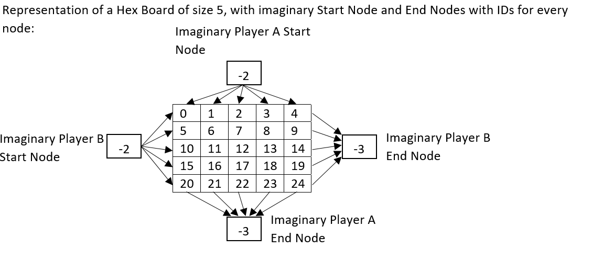

# Hex Game

Author: Prashant Kumar

Date: June 16th 2022

Program to Play Human vs Human or vs Computer

-------

## Representation:

A size 5 hex board has 5x5 squares.

Squares have 3 types – PlayerA, PlayerB or Empty.

Every Square acts as a node for path algorithms. Nodes have sequential ids from 0 to n x n - 1. For path algorithm purpose, an imaginary start and end node is created. Start and end nodes have the same id for PlayerA and PlayerB. Start node is given id -2 and end node -3. Nodes from one side are connected to start node and other side to end node as shown in representation below.

-------

## Program Structure

1. Game Constants

   - Player A is X (top to bottom), Player B is O (left to right)

   - Player Types – Human/Computer

   - Board Size

2. Functions

   - Check game won by a player (using Dijkstra’s for now, A star later)

   - Randomly Fill up Whole Board

   - Take User Input Move

   - Print Hex Board

3. Game Play

   - Hex Board with Current Positions

   - Best_next_move() Trial function to try out all legal moves 1000 times and classify each move with win loss ratio – return move with best win loss ratio

     - Vector of empty squares

     - For every square 1000 trials of randomly filling up board, noting who won and adding it to PlayerA or PlayerB

     - Returning best next move for PlayerA or PlayerB

-------

## Class Structure

1. Square: char

   - playerA = 'X',

   - playerB = 'O',

   - empty = '.',

2. Node

   - int id = kNullId;

   - int nearest_node_id = kNullId;

   - int distance = 1;    //distance to every node is 1 for hex game

   - static const int kNullId = -1;    //Node ids will be whole numbers

   - static const int graph_start_id = -2;    //an imaginary node id to start player's hex board graph from

   - static const int graph_end_id = -3;    //an imaginary node id to end player's hex board graph to

3. enum class PlayerType

   - Human = 0,

   - Computer = 1,

4. enum class Square : char

   - PlayerA = 'X',

   - PlayerB = 'O',

   - Empty = '.',

5. GameClass

   - playerA_type 0 – human /1 - computer

   - playerB_type 0 – human /1 – computer

   - playerA_name

   - playerB_name

   - board_size – 5 for testing, 11 for production

   - hex_board – pointer to pointer of Square

   - empty_squares_list – all squares have an id, we maintain an empty ids list to pick from

   - Functions:
   
     - GameClass(), constructor to initialize class object

     - take_user_input(Square player), return node_id
	 
	 - RunGame()

     - best_next_move(Square player), return node_id

     - print_hex_board()

6. ProcessBoard Class

   - Functions:
   
     - ProcessBoard(Square** hex_board_data, int board_size_data), constructor to create a copy of hex board and run simulation trials on it

     - bool game_won_check(Square player), (using Dijkstra’s for now, A star later), return 0 for game not won, 1 for game won

     - void fill_board_randomly(Square player, int node_id_as_next_move, std::list<int> empty_squares_list)

-------

## Pseudo Code

1. Load Game Constants

2. RunGame

   - If player == human

     - Take user input

   - Else player == computer

     - For each entry of list of empty squares run a simulation 1000 times

       - Fill all squares randomly

       - Check who won the game

       - Note win or loss for this simulation

       - Assign the entry with win/loss ratio

     - Return the entry with best win/loss ratio

   - Check if game is won, if yes then break else run the above for the other player

-------

## Game Runtime Output

                          Hex Game

Player v/s Computer

X goes first and takes vertical direction, O goes second and takes horizontal direction.

Enter PlayerA Type, 0 for human or 1 computer:0

PlayerA Name:Prashant
PlayerA is Prashant

Enter PlayerB Type, 0 for human or 1 computer:1
PlayerB is Computer

                          Hex Game

                X  |  top-to-bottom  | Prashant
                O  |  left-to-right  | Computer

              1    2    3    4    5
              --   --   --   --   --
        a  \   .    .    .    .    .   \  a

           b  \   .    .    .    .    .   \  b

              c  \   .    .    .    .    .   \  c

                 d  \   .    .    .    .    .   \  d

                    e  \   .    .    .    .    .   \  e

                             --   --   --   --   --
                               1    2    3    4    5

Prashant, win by making a connected path from Top-to-Bottom
Prashant enter next move:a5

Hex Board after 1 moves:

                          Hex Game

                X  |  top-to-bottom  | Prashant
                O  |  left-to-right  | Computer

              1    2    3    4    5
              --   --   --   --   --
        a  \   .    .    .    .    X   \  a

           b  \   .    .    .    .    .   \  b

              c  \   .    .    .    .    .   \  c

                 d  \   .    .    .    .    .   \  d

                    e  \   .    .    .    .    .   \  e

                             --   --   --   --   --
                               1    2    3    4    5

Running 1000 simulated trials........................

Player B,Computer picks c4

Hex Board after 2 moves:

                          Hex Game

                X  |  top-to-bottom  | Prashant
                O  |  left-to-right  | Computer

              1    2    3    4    5
              --   --   --   --   --
        a  \   .    .    .    .    X   \  a

           b  \   .    .    .    .    .   \  b

              c  \   .    .    .    O    .   \  c

                 d  \   .    .    .    .    .   \  d

                    e  \   .    .    .    .    .   \  e

                             --   --   --   --   --
                               1    2    3    4    5

Prashant, win by making a connected path from Top-to-Bottom
Prashant enter next move:b4

Hex Board after 3 moves:

                          Hex Game

                X  |  top-to-bottom  | Prashant
                O  |  left-to-right  | Computer

              1    2    3    4    5
              --   --   --   --   --
        a  \   .    .    .    .    X   \  a

           b  \   .    .    .    X    .   \  b

              c  \   .    .    .    O    .   \  c

                 d  \   .    .    .    .    .   \  d

                    e  \   .    .    .    .    .   \  e

                             --   --   --   --   --
                               1    2    3    4    5

Running 1000 simulated trials......................

Player B,Computer picks c3

Hex Board after 4 moves:

                          Hex Game

                X  |  top-to-bottom  | Prashant
                O  |  left-to-right  | Computer

              1    2    3    4    5
              --   --   --   --   --
        a  \   .    .    .    .    X   \  a

           b  \   .    .    .    X    .   \  b

              c  \   .    .    O    O    .   \  c

                 d  \   .    .    .    .    .   \  d

                    e  \   .    .    .    .    .   \  e

                             --   --   --   --   --
                               1    2    3    4    5

Prashant, win by making a connected path from Top-to-Bottom
Prashant enter next move:c3
Square already taken.
Prashant, win by making a connected path from Top-to-Bottom
Prashant enter next move:c2

Hex Board after 5 moves:

                          Hex Game

                X  |  top-to-bottom  | Prashant
                O  |  left-to-right  | Computer

              1    2    3    4    5
              --   --   --   --   --
        a  \   .    .    .    .    X   \  a

           b  \   .    .    .    X    .   \  b

              c  \   .    X    O    O    .   \  c

                 d  \   .    .    .    .    .   \  d

                    e  \   .    .    .    .    .   \  e

                             --   --   --   --   --
                               1    2    3    4    5

Running 1000 simulated trials....................

Player B,Computer picks d2

Hex Board after 6 moves:

                          Hex Game

                X  |  top-to-bottom  | Prashant
                O  |  left-to-right  | Computer

              1    2    3    4    5
              --   --   --   --   --
        a  \   .    .    .    .    X   \  a

           b  \   .    .    .    X    .   \  b

              c  \   .    X    O    O    .   \  c

                 d  \   .    O    .    .    .   \  d

                    e  \   .    .    .    .    .   \  e

                             --   --   --   --   --
                               1    2    3    4    5

Prashant, win by making a connected path from Top-to-Bottom
Prashant enter next move:b5

Hex Board after 7 moves:

                          Hex Game

                X  |  top-to-bottom  | Prashant
                O  |  left-to-right  | Computer

              1    2    3    4    5
              --   --   --   --   --
        a  \   .    .    .    .    X   \  a

           b  \   .    .    .    X    X   \  b

              c  \   .    X    O    O    .   \  c

                 d  \   .    O    .    .    .   \  d

                    e  \   .    .    .    .    .   \  e

                             --   --   --   --   --
                               1    2    3    4    5

Running 1000 simulated trials..................

Player B,Computer picks c5

Hex Board after 8 moves:

                          Hex Game

                X  |  top-to-bottom  | Prashant
                O  |  left-to-right  | Computer

              1    2    3    4    5
              --   --   --   --   --
        a  \   .    .    .    .    X   \  a

           b  \   .    .    .    X    X   \  b

              c  \   .    X    O    O    O   \  c

                 d  \   .    O    .    .    .   \  d

                    e  \   .    .    .    .    .   \  e

                             --   --   --   --   --
                               1    2    3    4    5

Prashant, win by making a connected path from Top-to-Bottom
Prashant enter next move:e5

Hex Board after 9 moves:

                          Hex Game

                X  |  top-to-bottom  | Prashant
                O  |  left-to-right  | Computer

              1    2    3    4    5
              --   --   --   --   --
        a  \   .    .    .    .    X   \  a

           b  \   .    .    .    X    X   \  b

              c  \   .    X    O    O    O   \  c

                 d  \   .    O    .    .    .   \  d

                    e  \   .    .    .    .    X   \  e

                             --   --   --   --   --
                               1    2    3    4    5

Running 1000 simulated trials................

Player B,Computer picks d1

Hex Board after 10 moves:

                          Hex Game

                X  |  top-to-bottom  | Prashant
                O  |  left-to-right  | Computer

              1    2    3    4    5
              --   --   --   --   --
        a  \   .    .    .    .    X   \  a

           b  \   .    .    .    X    X   \  b

              c  \   .    X    O    O    O   \  c

                 d  \   O    O    .    .    .   \  d

                    e  \   .    .    .    .    X   \  e

                             --   --   --   --   --
                               1    2    3    4    5

Player B, Computer Won!!!

Game won in 10 moves!

C:\Programming\3.C++forCProgrammers\Hex_Game\x64\Debug\Hex_Game.exe (process 19188) exited with code 0.
Press any key to close this window . . .